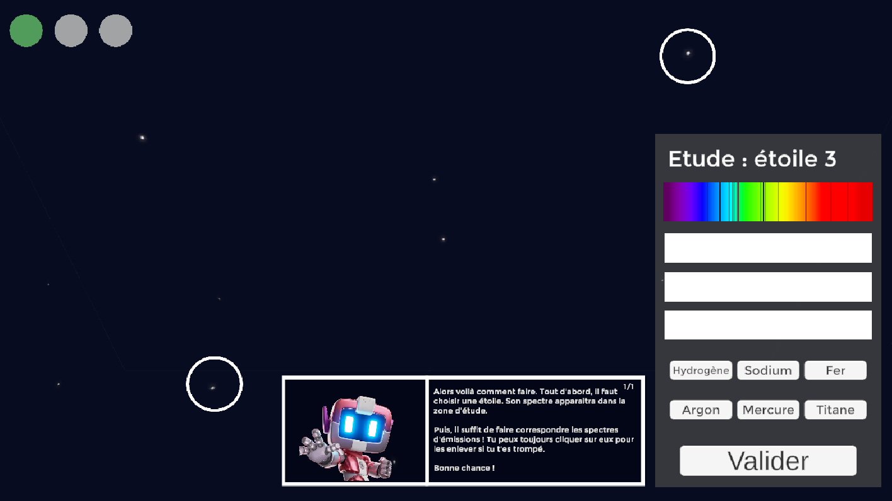
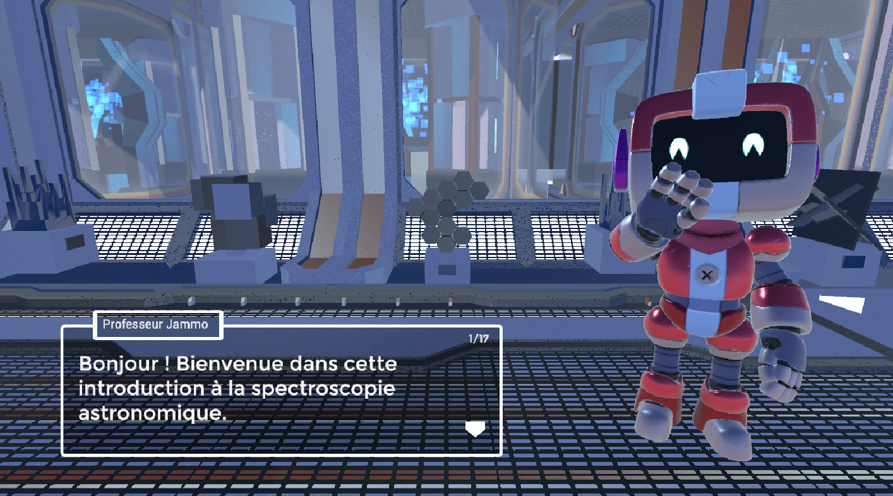
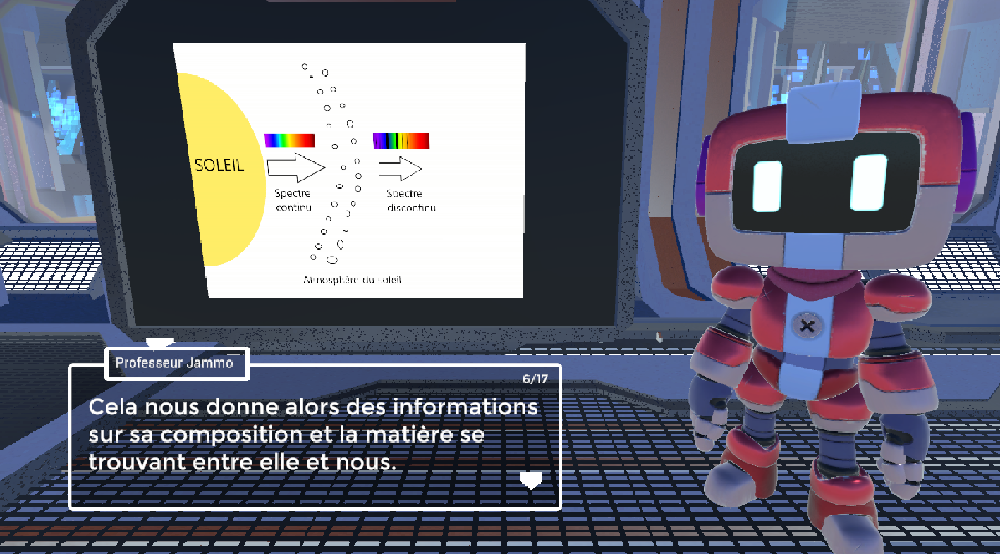
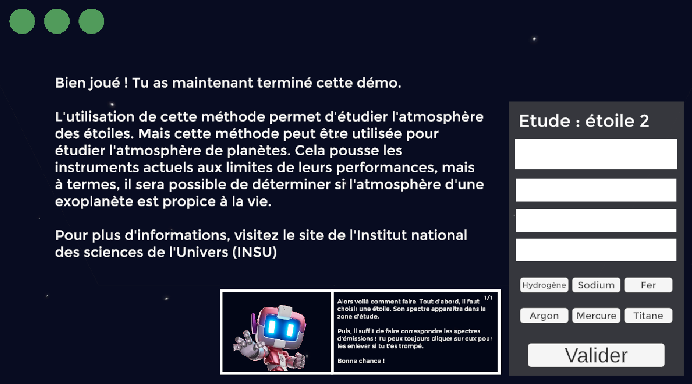

# Prototype Game Design 
## Introduction à la spectroscopie astronomique

Cédric Maggay - Ludus Académie - Strasbourg - 2022

### Introduction
Ce projet est un prototype de jeu sérieux destiné à vulgariser les notions fondamentales de spectroscopie astronomique. Vous incarnez un robot chargé d’analyser et de déterminer la composition chimique d’étoiles à travers l’analyse des spectres d’absorptions et d’émissions.

Ce projet est présenté dans le cadre de l’épreuve de prototypage de Game Design en vue de l’obtention du Mastère Européen Jeux Vidéo et Serious Games à Ludus Académie – Strasbourg. 

### Intentions
- Mettre en avant une des grandes thématiques de la recherche spatiale.
- Diffuser et vulgariser les bases de la spectroscopie.
- Proposer une expérience formatrice et ludique. 
- Faire en sorte que les joueurs quittent l’expérience avec des connaissances sur le long terme.
- Développer la curiosité des joueurs sur le sujet 
- Donner les clés de compréhension pour approfondir le sujet par la suite

### Screenshots

<table>
	<tr>
		<td></td>
		<td></td>
	</tr>
	<tr>
		<td></td>
		<td></td>
	</tr>
</table>
